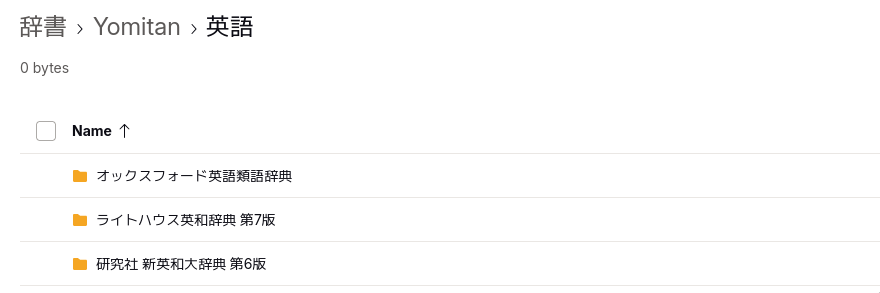

# Yomitan

Yomitan  は、ブラウザ上で外国語学習を支援する「ポップアップ辞書」の拡張機能です。文章中の単語にカーソルを合わせるだけで瞬時に意味や発音が表示され、学習の効率を大幅に上げることを目指しています。

- **ポップアップ辞書**: デフォルトで**Shift キーを押しながら**単語にカーソルを合わせると、その場で定義が表示されます。
- **多言語・多辞書対応**: 日本語、英語、スペイン語など 20 言語以上に対応し、複数の辞書を追加して使えます。
- **Anki との連携**: 単語をワンクリックで Anki 単語帳のカードに変換・追加できます（別途セットアップが必要）。
- **オフライン動作・無料**: 辞書を導入後はインターネットなしで利用でき、完全無料でデータ追跡もありません。

Yomitan を使用するには、お使いのブラウザの公式ストアからインストールします。

- **Google Chrome / Microsoft Edge**: [Chrome Web Store](https://chromewebstore.google.com/detail/yomitan-popup-dictionary/likgccmbimhjbgkjambclfkhldnlhbnn)
- **Mozilla Firefox**: [Firefox Add-ons](https://addons.mozilla.org/addon/yomitan)

### Yomitanのおすすめ辞書

ダウンロード: [Caoimhe's drive](https://drive.proton.me/urls/GH0GV6DMEC#RP55zc2DL8vD) ([MarvNCさんのGitHubリポジトリ](https://github.com/MarvNC/yomitan-dictionaries?tab=readme-ov-file#english-japanese))

- 研究社 新英和大辞典
- オックスフォード英語類語辞典
- ライトハウス英和辞典 第 7 版

### 辞書データの追加（必須）

インストール直後は辞書が空のため、必ず以下で辞書を追加する必要があります。

1.  ブラウザツールバーの Yomitan アイコンをクリックし、歯車マークの「**設定（Settings）**」を開きます。
2.  左メニューの「**Dictionaries**」を選択。
3.  まず「**Get recommended dictionaries...**」をクリックし、学習する言語の辞書をウェブ上から選んでインポートできます。

    
4.  または、第三者が共有する詳細な辞書パック（例：日本語学習者向けの JMdict や KANJIDIC などのセット）をダウンロードし、同じ設定画面の「**Configure installed and enabled dictionaries...**」→「**Import**」から手動で追加することも可能です。
    

Demo:

### 使い始めるコツと詳細設定

- **PDF やローカルファイルを読みたい場合**: Chrome/Edge では、拡張機能の管理ページ（`chrome://extensions`）で Yomitan の「**ファイルの URL へのアクセスを許可する**」を有効にする必要があります。
- **Anki と連携したい場合**: Anki に「AnkiConnect」という追加機能をインストールした後、Yomitan の設定内で連携を有効にする必要があります。
- **トラブルシューティング**: 設定やインポートで問題が発生した場合は、公式サイトの[よくある質問](https://yomitan.wiki/support/)や[Discord コミュニティ](https://yomitan.wiki/support/)が役立ちます。

### Safari ユーザーへの代替案

Yomitan は現在 Safari に対応していませんが、類似の機能を提供する「**10ten Reader**」という拡張機能が利用可能です。